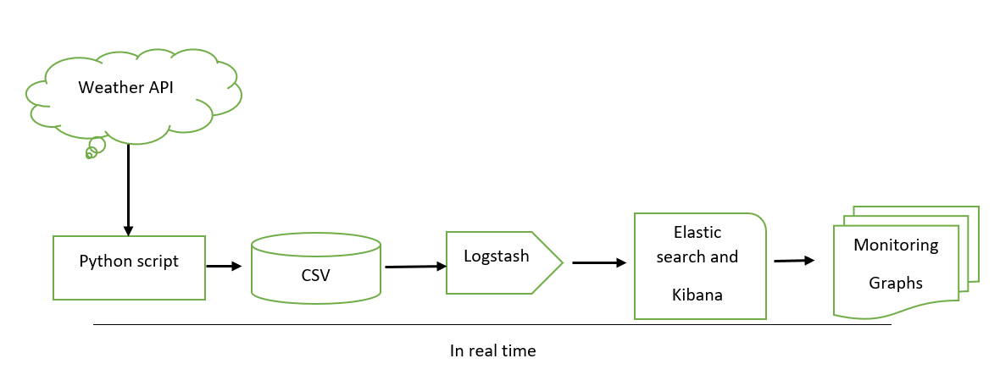
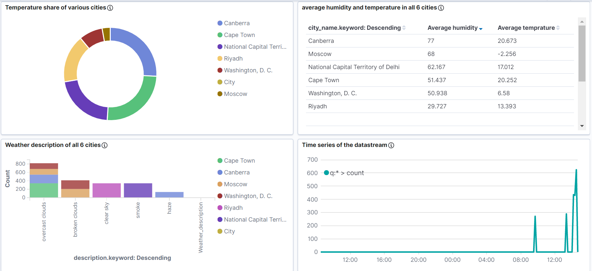

# Weather-dashboard
I have used ELK stack to store and monitor weather data streamed by python from [open weather api](https://openweathermap.org/).
* Python script is used to get data from open weather API in a streamed manner.
* We are handling the returned JSON response of API and extracting relevant fields and storing them into CSV.
* Logstash is used to collect and transfer that data to elastic search.
* Kibana is further used to make real-time dashboard on top of elastic search data, to monitor the live data of weather.
* Everything is happening in real-time. 
# App working 
* Following is the flow of the app.
   
   
* First of all, we need elastic search and Kibana servers up and running. 
* The next step is to configure the Logstash, by providing relevant input, filter, and output, according to your need.
* Next run the python script
* Finally configure the index in Kibana and make the visualization and dashboard like below.
    
  

# Important 
* I am using API for city codes, here is an [example](https://samples.openweathermap.org/data/2.5/group?id=524901,703448,2643743&units=metric&appid=b6907d289e10d714a6e88b30761fae22). we can specify maximum 20 cities using the city [ids](http://bulk.openweathermap.org/sample/). However I just used 6 cities, but feel free to use it 20 cities to make the app more useful. 
* temperature is provided in Celsius.
# Future scope
* Here in this example we are just using the data of 6 cities, but we can extend up to 20 cities.
* Open weather API returns various data fields related to the weather of the particular city, but here we are mainly using temperature,   humidity and weather description, but feel free to use more fields and make more visualizations to make the app more useful. 

:copyright: Birender Veer Singh
